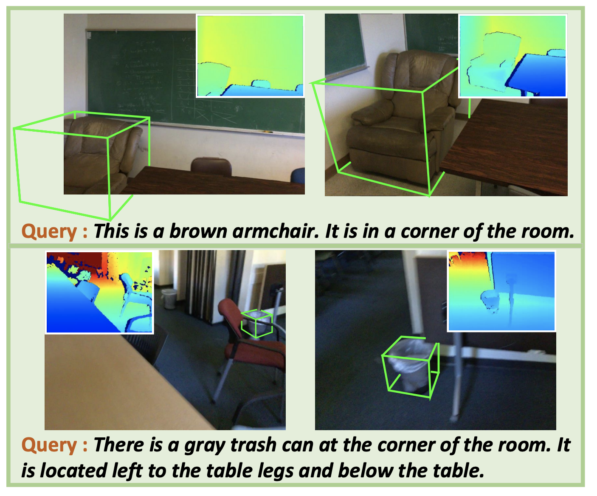

Greetings! I am Liu Haolin, a Ph.D student at the Chinese University of HongKong, Shenzhen, under the supervision of
<a href="https://gaplab.cuhk.edu.cn/">Prof. Xiaoguang Han</a>. My current research focus is about indoor scene reconstruction and understanding. 
I will be an intern in Tencent AI lab for the next few months. I am currently dedicated to advancing research in 3D AIGC.  
I will graduate in Octo 2024, and I am actively exploring exciting job opportunities or postdoc position.  
My resume can be accessed from <a href="https://haolinliu97.github.io/files/resume.pdf">resume</a>.

## Interest
* Instance-level scene reconstruction, object reconstruction
* text-to-3D
* 3D object detection and indoor scene understanding

## News
* [2023.07] MVImgNet 2.0 and GarVerseLOD got accepted as ACM TOG 2024.  
* [2023.12] Our latest work LASA is now released!  
* [2023.03] MVImgNet got accepted by CVPR 2023.  
* [2022.05] InstPIFu got accepted by ECCV 2022.  
* [2021.03] Refer-it-in-RGBD got accepted by CVPR 2021.  
* [2020.06] JAFPro got accepted by ACM MM 2020.  

## Publication

  

  

  
  
    
      <b>MVImgNet2.0: A Larger-scale Dataset of Multi-view Images</b>
       
     
    
      Yushuang Wu*, 
      Luyue Shi*,
      <b>Haolin Liu*</b>,
      Hongjie Liao,
      Lingteng Qiu,
      Weihao Yuan,
      Xiaodong Gu,
      Zilong Dong,
      Shuguang Cui,
      <a href="https://gaplab.cuhk.edu.cn/">Xiaoguang Han&dagger;</a>
       
     
    
      ACM Transactions on Graphics (<b>TOG</b>), 2024
       
     
    
      Paper, code, dataset are coming Soon
    
  

  

  

  
  
    
      <b>LASA: Instance Reconstruction from Real Scans using A Large-scale Aligned Shape Annotation Dataset</b>
       
     
    
      <b>Haolin Liu*</b>, 
      <a href="https://github.com/hugoycj">Chongjie Ye*</a>, 
      <a href="https://yinyunie.github.io">Yinyu Nie</a>,
      Yingfan He,
      <a href="https://gaplab.cuhk.edu.cn/">Xiaoguang Han&dagger;</a>
       
     
    
      Computer Vision and Pattern Recognition Conference (<b>CVPR</b>), 2024
       
     
    
      <a href="https://arxiv.org/abs/2312.12418">[paper]</a> /
      <a href="https://gap-lab-cuhk-sz.github.io/LASA/">[project]</a> /
      <a href="https://github.com/GAP-LAB-CUHK-SZ/LASA">[code]</a>
    
  

 

  

  

  

    
      <b>MVImgNet: A Large-scale Dataset of Multi-view Images</b>
       
     
    
      Xianggang Yu*, 
      Mutian Xu*,
      Yidan Zhang*,
      <b>Haolin Liu*</b>,
      <a href="https://github.com/hugoycj">Chongjie Ye*</a>, 
      Yushuang Wu,
      Zizheng Yan,
      Chenming Zhu,
      Zhangyang Xiong,
      Tianyou Liang,
      <a href="https://guanyingc.github.io/">Guanying Chen</a>,
      Shuguang Cui,
      <a href="https://gaplab.cuhk.edu.cn/">Xiaoguang Han&dagger;</a>
       
     
    
      Computer Vision and Pattern Recognition Conference (<b>CVPR</b>), 2023
       
     
    
      <a href="https://openaccess.thecvf.com/content/CVPR2023/papers/Yu_MVImgNet_A_Large-Scale_Dataset_of_Multi-View_Images_CVPR_2023_paper.pdf">[paper]</a> /
      <a href="https://gaplab.cuhk.edu.cn/projects/MVImgNet/">[project]</a> /
      <a href="https://github.com/GAP-LAB-CUHK-SZ/MVImgNet">[code]</a>
    
  

 

  

  

  

    
      <b>Towards High-Fidelity Single-view Holistic Reconstruction of Indoor Scenes</b>
       
     
    
      <b>Haolin Liu*</b>, 
      <a href="https://paulyzheng.github.io/about/">Yujian Zheng*</a>, 
      <a href="https://guanyingc.github.io/">Guanying Chen</a>,
      Shuguang Cui,
      <a href="https://gaplab.cuhk.edu.cn/">Xiaoguang Han&dagger;</a>
       
     
    
      European Conference on Computer Vision (<b>ECCV</b>), 2022
       
     
    
      <a href="https://arxiv.org/abs/2207.08656">[paper]</a> /
      <a href="https://github.com/GAP-LAB-CUHK-SZ/InstPIFu">[code]</a>
    
  

 

  

  

  

    
      <b>TO-Scene: A Large-scale Dataset for Understanding 3D Tabletop Scenes</b>
       
     
    
      Mutian Xu*, 
      Yidan Zhang*, 
      <b>Haolin Liu</b>,
      <a href="https://gaplab.cuhk.edu.cn/">Xiaoguang Han&dagger;</a>
       
     
    
      European Conference on Computer Vision (<b>ECCV</b>), 2022, <b>Oral Presentation</b>
       
     
    
      <a href="https://arxiv.org/abs/2203.09440">[paper]</a> /
      <a href="https://github.com/GAP-LAB-CUHK-SZ/TO-Scene">[code]</a>
    
  

 

  

  

  

    
      <b>Refer-it-in-RGBD: A Bottom-up Approach for 3D Visual Grounding in RGBD Images</b>
       
     
    
      <b>Haolin Liu</b>,
      Anran Lin,
      <a href="https://gaplab.cuhk.edu.cn/">Xiaoguang Han&dagger;</a>,
      Lei Yang,
      Yizhou Yu,
      Shuguang Cui
       
     
    
      Computer Vision and Pattern Recognition Conference (<b>CVPR</b>), 2021
       
     
    
      <a href="https://arxiv.org/abs/2103.07894">[paper]</a> /
      <a href="https://github.com/HaolinLiu97/Refer-it-in-RGBD">[code]</a>
    
  

 

  

  

  

    
      <b>JAFPro: Joint Appearance Fusion and Propagation for Human Video Motion Transfer from Multiple Reference Images</b>
       
     
    
      Xianggang Yu*,
      <b>Haolin Liu*</b>,
      <a href="https://gaplab.cuhk.edu.cn/">Xiaoguang Han&dagger;</a>,
      Zhen Li,
      Zixiang Xiong,
      Shuguang Cui
       
     
    
      ACM International Conference on Multimedia (<b>ACM MM</b>), 2020
       
     
    
      <a href="https://dl.acm.org/doi/abs/10.1145/3394171.3414001">[paper]</a> /
      <a href="https://github.com/Larry-u/JAFPro">[code]</a>
    
  

 

* indicates co-first author, &dagger; indicates corresponding author.

